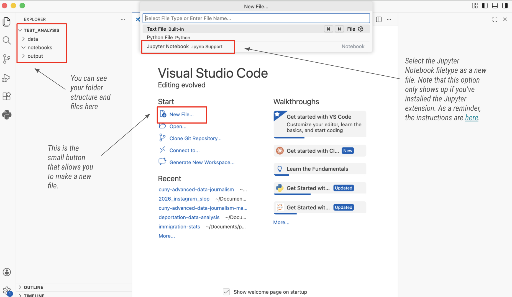
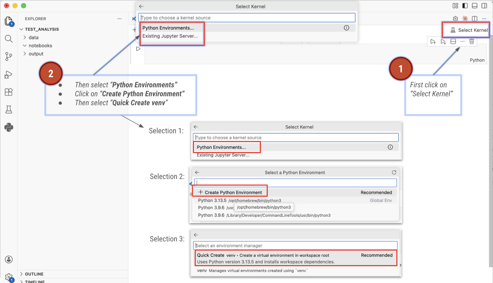

# Your first Jupyter Notebook in VS Code!

Setting up a jupyter notebook project can be A LOT. While you have the slides from your class [here](https://docs.google.com/presentation/d/1Ft3uAewlY2lFZZqtrTPtEM9idxTIl6YN5srvTODeAZ0/edit?usp=sharing), feel free to use this quick run-down of commands for when you're in a hurry to get your data analysis started.


Below is a quick rundown of commands:

### Organize your data projects

Make a project folder, then make three folders inside of the folder:

- `data`: this is where all the data goes in its original format
- `output`: one for all your output data, meaning the results of your data.
- `notebooks`: one. for your notebooks, where you will store all of your Python-based analyses. 

### Make your virtual environment
To set up a virtual environment for your project, first open your project in VS Code (this also works for projects you already have):

1. Start up VS Code
2. Open the existing folder 
3. Make a new notebook 


_An illustration of the VS Code interface, showing steps 1-3_

For your Jupyter Notebook to work you need to connect it to a functioning virtual environment. 
 
4. Click on the “Select Kernel” button 
5. Then select “Python Environments” 
6. If this is the first time you open this project, then you will need to create a new Python environment. Click on “Create Python Environment”. Then select “Quick Create venv”
7. After you have set up this environment once, you can use it again and again for the project that is in the same folder
8. Save your file in your notebooks folder



_An illustration of the VS Code interface, showing steps 4-8_


### Installing libraries

While your environment is activated and connected you can install multiple libraries that you may need in your environment. You can type the following into a cell to install any library:
```
!pip install NAME_OF_LIBRARY
```
One example for this would be, installing pandas, which we use extensively in this class. This is how you'd do it:
```
!pip install pandas
```